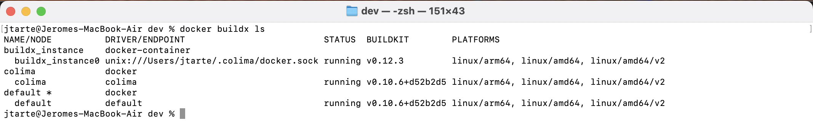
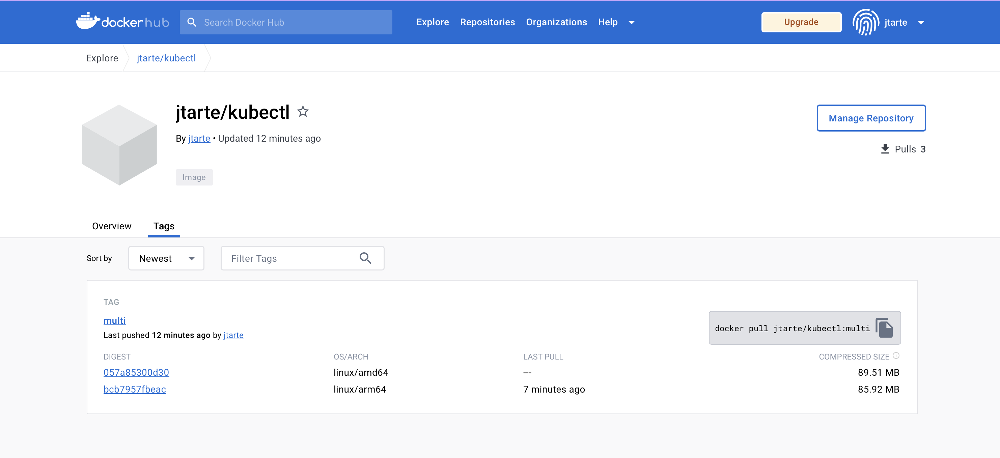
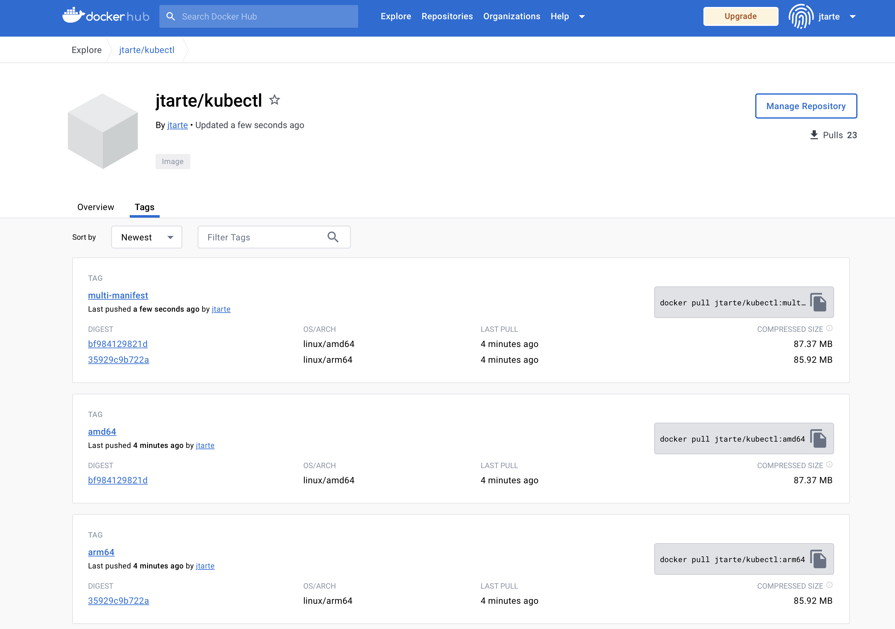

# Build multi architecture docker image on MAC M2 with colima


## install buildx plugin

`buildx` is a plugin that extends build capabilities with BuildKit

```
brew install docker-buildx
```

then, you have to make available the plugin to docker cli by creating a symbolic link.
```
mkdir -p ~/.docker/cli-plugins
ln -sfn /opt/homebrew/opt/docker-buildx/bin/docker-buildx ~/.docker/cli-plugins/docker-buildx
```

## Option 1: use a dedicated builder
### Create a builder 

The default docker builder doesn't support multi platform. You should create and use a nex one.
```
docker buildx create --use --name buildx_instance
```


### Buid the image 

Build the image 
```
docker buildx build --platform linux/amd64,linux/arm64 -t jtarte/kubectl:multi --push .
```

The result could be checked on the docker registry (here docker hub).


## Option 2: use the defaukt docker builder

If the default docker build driver doesn't support multi platfrom, it could be used to build an image for a desired platform. So, you could use to build different images for the different platfoms then create a manifest includign all the platfrom images.

### build images for specific platforms

__********************************__<BR>
__Ensure to use the default driver__
```
docker buildx use default
```
__***__

For arm64 (for exeample Mac M1/M2):
```
docker buildx build --platform linux/arm64 -t jtarte/kubectl:arm64 --push .
```

For amd64 (intel based, used on many platforms and cloud):
```
docker buildx build --platform linux/amd64 -t jtarte/kubectl:amd64 --push .
```

The `--push` option ensures that the resulting immage on a target registry (in my sample, it is docker hub).  

It is mandatory as the next command, working on manifest, doen't work with local image. The images used to build the manaifest should be present on a image registry.

### build the multi platform manifest 

Build the manifest locally
```
docker manifest create jtarte/kubectl:multi-manifest jtarte/kubectl:arm64 jtarte/kubectl:amd64 
```

Then push it
```
docker manifest push  jtarte/kubectl:multi-manifest
```



The main difference with option 1 is that you could see 3 entries on the docker registry:
* one for the amd64 image
* one for the arm64 image 
* one for the manifest including the two images.

## Dockerfile and cross-platform build
Inside the dockerfile, you could add  directive to take care of the target platform

in this exemple, I'm using the `TARGETARCH` argument to dowload the right version of the tools, I am adding to the image. 

more info about [Automatic platform ARGs in the global scope](https://docs.docker.com/engine/reference/builder/?_gl=1*1xz5r7u*_ga*MTAyMDk4NDY3NS4xNjk3ODc1MTg5*_ga_XJWPQMJYHQ*MTY5Nzg3NTE4OS4xLjEuMTY5Nzg3NTE5MC41OS4wLjA.#automatic-platform-args-in-the-global-scope) could be find in docker documentation.

## References
* [docker buildx build](https://docs.docker.com/engine/reference/commandline/buildx_build/)
* [Automatic platform ARGs in the global scope](https://docs.docker.com/engine/reference/builder/?_gl=1*1xz5r7u*_ga*MTAyMDk4NDY3NS4xNjk3ODc1MTg5*_ga_XJWPQMJYHQ*MTY5Nzg3NTE4OS4xLjEuMTY5Nzg3NTE5MC41OS4wLjA.#automatic-platform-args-in-the-global-scope)

